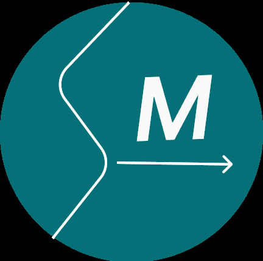

<h2>Computer Vison</h2>

 

 

## :rotating_light: *NOTICE* :rotating_light:
#### About This Repos 
This repository is intended for learning, research and experimentation in the field of computer vision using Opencv, but it can still be extended to other fields.

1 - __Main Branch__ 

The main branch is an integration branch where bug/feature fixes are collected for functional testing.

2 - __Release Branch__ 

The release branch is where releases are maintained and hot fixes (with names like release/v2.x.x) are added. Please ensure that all your production-related work are tracked with the release branches.

With this new model, we can push out bug fixes more quickly and achieve simpler maintenance.

3 - __Your own Branch__ 
For your own testing, you can create your own branch as a sandbox. If you notice a noticeable change that does not break the main system, you can send a pull request.

### Roadmap 
For the learning curve here is a plan to follow
first have a good understanding of the *NumPy library, including: array creation, basic operations, indexing, slicing, iteration...
#### Plan
*[ Gui Features in OpenCV ](#chap1)
	*[Getting Started with Images](#1lesson1) 
		Learn to load an image, display it, and save it bac
		[Tutorial  Display image](https://docs.opencv.org/4.x/db/deb/tutorial_display_image.html)
	*[Getting Started with Videos](#1lesson2) 
	Learn to play videos, capture videos from a camera, and write videos
	*[Drawing Functions in OpenCV](#1lesson3)
	Learn to draw lines, rectangles, ellipses, circles, etc with OpenCV

*[Core Operations](#chap2)
	*[Basic Operations on Images](#2lesson1) 
	Learn to read and edit pixel values, working with image ROI and other basic operations.
	*[Arithmetic Operations on Images](#2lesson2)
	 Perform arithmetic operations on images

*[Image Processing in OpenCV](#chap3)
	*[Changing Colorspaces](#3lesson1)
	Learn to change images between different color spaces. Plus learn to track a colored object in a video.
	*[Geometric Transformations of Images](#3lesson2)
	 Learn to apply different geometric transformations to images like rotation, translation etc.
	*[Image Thresholding](#3lesson3) 
	Learn to convert images to binary images using global thresholding, Adaptive thresholding, Otsu's binarization etc
	*[Smoothing Images](#3lesson4) 
	Learn to blur the images, filter the images with custom kernels etc.
	*[Morphological Transformations](#3lesson5)
	Learn about morphological transformations like Erosion, Dilation, Opening, Closing etc
	*[Image Gradients](#3lesson6)
	Learn to find image gradients, edges etc.
	*[Canny Edge Detection](#3lesson7)
 	Learn to find edges with Canny Edge Detection
	*[Image Pyramids](#3lesson8)
	 Learn about image pyramids and how to use them for image blending
	*[Contours in OpenCV](#3lesson9) 
	All about Contours in OpenCV
	*[Histograms in OpenCV](#3lesson10) All about histograms in OpenCV
	*[Image Transforms in OpenCV](#3lesson11) 
	Meet different Image Transforms in OpenCV like Fourier Transform, Cosine Transform etc.
	*[Template Matching](#3lesson12)
	 Learn to search for an object in an image using Template Matching
	 *[Hough Line Transform](#3lesson13) 
	 Learn to detect lines in an image
	 *[Hough Circle Transform](#3lesson14) 
	 Learn to detect circles in an image
	 *[Image Segmentation with Watershed Algorithm](#3lesson15) 
	 Learn to segment images with watershed segmentation
	 *[Interactive Foreground Extraction using GrabCut Algorithm](#3lesson16)
	  Learn to extract foreground with GrabCut algorithm
	  
*[Feature Detection and Description](#chap4)
	*[Introduction to SIFT (Scale-Invariant Feature Transform)](#4lesson1)
	Harris corner detector is not good enough when scale of image changes. Lowe developed a breakthrough method to find scale-invariant features and it is called SIFT
	*[Introduction to SURF (Speeded-Up Robust Features)](#4lesson2)
	 SIFT is really good, but not fast enough, so people came up with a speeded-up version called SURF.
	*[ORB (Oriented FAST and Rotated BRIEF)](#4lesson3) 
	SIFT and SURF are good in what they do, but what if you have to pay a few dollars every year to use them in your applications? Yeah, they are patented!!! To solve that problem, OpenCV devs came up with a new "FREE" alternative to SIFT & SURF, and that is ORB.

[Tutorial link](https://docs.opencv.org/4.x/d6/d00/tutorial_py_root.html) :rocket: 

**Love  Pull Request** 

